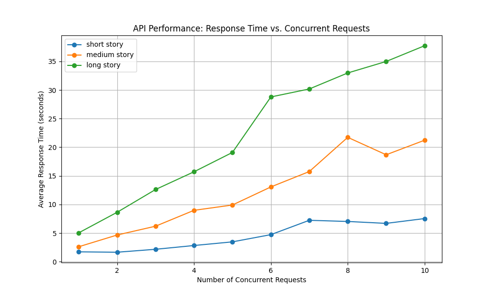

# Story2Audio

A microservice that converts stories into engaging audio with emotional inflections.

## Features

- Text emotion analysis to detect the emotional tone of different parts of a story
- Text-to-speech generation with emotional inflections
- gRPC API for integration with other services
- Gradio web interface for easy testing

## Setup

### Prerequisites

- Python 3.9+
- eSpeak NG (required for TTS phoneme processing)
- Docker (optional, for containerized deployment)

### Installation

1. Clone the repository:
   ```bash
   git clone https://github.com/yourusername/story2audio.git
   cd story2audio
2. Create and activate a virtual environment:

    python -m venv venv
    # On Windows
    venv\Scripts\activate
    # On Linux/Mac
    source venv/bin/activate

3. Install dependencies:

    pip install -r requirements.txt

4. Generate gRPC code:

    python -m grpc_tools.protoc -I./api --python_out=./api --grpc_python_out=./api ./api/story_audio.proto

5. Start the server:

    python api/server.py

6. In a separate terminal, start the frontend:

    cd frontend
    python app.py

## Usage

1. Open the Gradio interface in your browser (default: http://localhost:7860)
2. Enter a story in the text input or select from example stories
3. (Optional) Specify a voice type (default is p225)
4. Click "Generate Audio" to create an audio version with emotional inflections
5. The audio will play automatically and can be downloaded

## Docker DeploymentDocker Deployment

### Using Docker Compose (Recommended)

The easiest way to run both the server and frontend:

    docker-compose up

    This will start both the gRPC server and the Gradio frontend. The frontend will be accessible at http://localhost:7860.


## Project Structure

'''story2audio/
├── api/
│   ├── server.py                # gRPC server implementation
│   ├── story_audio.proto        # Protocol buffer definition
├── frontend/
│   └── app.py                   # Gradio web interface
├── models/
│   ├── emotion_analyzer.py      # Emotion detection model
│   └── tts_generator.py         # Text-to-speech generation
├── tests/
│   ├── test_emotion_analyzer.py # Unit tests for emotion analyzer
│   └── performance_test.py      # Performance testing script
├── Dockerfile                   # Docker configuration
├── docker-compose.yml           # Docker Compose configuration
├── requirements.txt             # Python dependencies
└── README.md                    # Project documentation'''

## Testing

Run the test suite:

    python tests/test_emotion.py

## Performance Evaluation

We tested our API's performance with concurrent requests using different story lengths:



The graph shows response times for short (10 words), medium (50 words), and long (100+ words) stories with increasing concurrent requests. As expected, longer stories take more time to process, but the system handles concurrency well.

Key observations:
- Short stories (~10 words): Processing time increases slightly with concurrent requests
- Medium stories (~50 words): Processing time shows moderate scaling with load
- Long stories (100+ words): Processing time increases more significantly under concurrent load

This performance analysis helps us understand the system's scalability limits and appropriate provisioning for production deployment.


## Limitations

Limited voice variety: Currently uses VCTK voices only
English language only
Simple emotional mapping (5 primary emotions)
Concurrent processing limited by available system resources

## License
MIT

## Acknowledgements

Coqui TTS for TTS capabilities
Hugging Face Transformers for emotion detection
Gradio for the web interface
gRPC for API communication